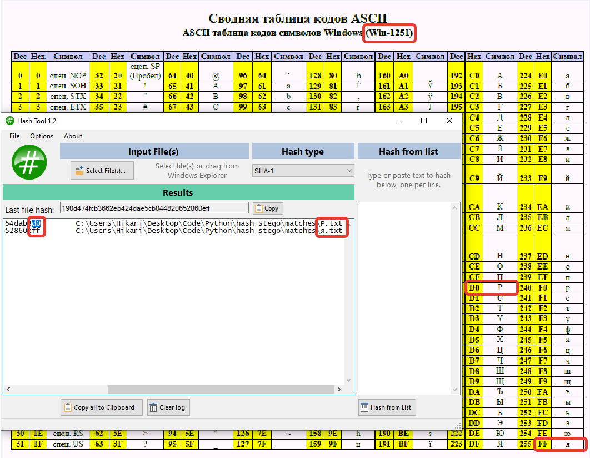

# Hash-Finder

Инструмент для создания стеганографических головоломок на основе SHA-1 хешей. Генерирует файлы, последние байты хешей которых соответствуют заданным символам в кодировке Windows-1251.

## Назначение

Программа создает задания по стеганографии, где скрытый текст извлекается из последних байтов хешей файлов. Студенты должны:
1. Вычислить SHA-1 хеши всех файлов
2. Взять последний байт каждого хеша
3. Декодировать байты как символы Windows-1251
4. Собрать скрытое сообщение

## Принцип работы

1. Пользователь вводит строку символов (например, "Привет")
2. Программа конвертирует символы в hex-коды Windows-1251
3. Генерирует случайные файлы до тех пор, пока не найдет хеши с нужными последними байтами
4. Сохраняет подходящие файлы в папку `matches/`

## Использование

```bash
python hash_stego.py
```

Введите символы для скрытого сообщения:
```
Enter the required unique characters from win-1251: Привет
```

## Результат

Программа создаст файлы:
- `П.txt` - файл с хешем, заканчивающимся на `CF` (код символа 'П')
- `р.txt` - файл с хешем, заканчивающимся на `F0` (код символа 'р')
- И так далее...

## Пример задания для студентов

> "В папке находится несколько текстовых файлов. Вычислите SHA-1 хеш каждого файла, возьмите последний байт хеша и декодируйте его как символ Windows-1251. Расположите символы в алфавитном порядке имен файлов - получится скрытое сообщение."

## Настройки

В коде можно изменить:
- **Алгоритм хеширования:** `hashlib.sha1()` → `hashlib.md5()`, `hashlib.sha256()`
- **Кодировка:** `windows-1251` → `utf-8`, `cp866`
- **Алфавит генерации:** `string.ascii_letters + string.digits`

## Структура проекта

```
hash_stego.py      # Основной скрипт
matches/           # Папка с результатами (создается автоматически)
temp/              # Временные файлы (удаляется после работы)
```

## Образовательная ценность

Проект демонстрирует:
- Работу с криптографическими хеш-функциями
- Кодировки символов и их hex-представление
- Основы стеганографии
- Алгоритмы поиска методом перебора

## Результат работы, проверка хешей


